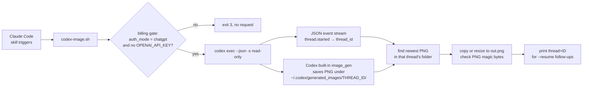

# codex-image

A shell script and a Claude Code skill that let Claude Code produce real raster images by driving OpenAI Codex CLI's built-in image tool headless, on a ChatGPT plan instead of the metered API.

> **Status: work in progress.** I use it from Claude Code; it depends on how Codex CLI behaves today, and that can change with any Codex release.

## Why I built it

Claude Code has no image generator. When a project needed an icon or a background, it drew one in code (PIL, pycairo, SVG or CSS gradients), and the results looked like they were drawn in code. I already pay for a ChatGPT plan, and its Codex CLI can generate images. So I wired Codex in as a skill: Claude asks Codex for the picture, waits about a minute, looks at it, and copies the file into the project.


*Example output (scaled down): a transparent petal plate Codex made for a phone battery widget. The live widget draws its text and lit petals in code on top of art like this.*

## How it works



- **Billing gate.** The script reads `auth_mode` from `$CODEX_HOME/auth.json` (it never prints the file). It refuses to run unless Codex is logged in with a ChatGPT account and `OPENAI_API_KEY` is unset, because the API path is billed per image.
- **Finding the file.** The generated image is not in Codex's JSON output. The script takes the thread id from the `thread.started` event and picks the newest PNG in `generated_images/<thread_id>/`.
- **Read-only sandbox.** Codex runs with `-s read-only` in an empty temp directory, so it cannot run shell commands against your project. The image save is done by Codex itself, not by a sandboxed shell.
- **Follow-ups.** `--resume <thread>` continues the same Codex conversation, so "make it more pink" changes the existing picture instead of starting over.
- **References.** `--ref in.png` attaches an image and tells Codex it is a reference. It kept the layout of the reference well in my tests.
- **The skill** (`skill/SKILL.md`) tells Claude when to use it: when you ask for an image, and on its own when code it is writing needs a raster asset. It also tells Claude to look at every result and not to use it for data-driven faces (anything that changes with a value) or pixel-exact work.

## Numbers

Measured by hand on 2026-10-04, one machine, codex-cli 0.160.0. Small samples, not benchmarks.

| what | result |
|---|---|
| time per image | 34 to 87 s (n=7) |
| parallel runs | 3 at once worked (number of batches not recorded) |
| exact text in the image | spelled right 3 of 3 times (n=3) |
| native size | about 1024 to 1254 px square; one portrait request came back 853x1844 |

## Limits and caveats

- This relies on undocumented Codex CLI behaviour: the `thread.started` event, the `generated_images/<thread_id>/` folder, and the built-in tool being used when asked. A Codex update can break any of these.
- Image generation counts against your ChatGPT plan's usage limits.
- One call makes one image in one state. Anything that changes with data should be composited in code on top of generated art.

## Install

You need:

- Linux or macOS with `bash` and `python3`.
- A ChatGPT plan that includes Codex, and [Codex CLI](https://github.com/openai/codex) installed (`npm install -g @openai/codex`).
- [Claude Code](https://claude.com/claude-code), for the skill.
- Optional: ImageMagick (`magick`, `identify`) for `--size` and for printing the image size.

Steps:

1. Log Codex in with your ChatGPT account (not an API key): run `codex login` and pick "Sign in with ChatGPT".
2. Make sure `OPENAI_API_KEY` is not set in your shell. The script refuses to run if it is.
3. Put the script on your PATH:
   ```
   install -m 755 codex-image.sh ~/.local/bin/codex-image.sh
   ```
4. Install the skill for Claude Code:
   ```
   mkdir -p ~/.claude/skills/codex-image
   cp skill/SKILL.md ~/.claude/skills/codex-image/
   ```
5. Optional: add a line to `~/.claude/CLAUDE.md` such as "Code that needs a raster image gets it from the codex-image skill, not drawn in PIL/SVG", so Claude reaches for it without being asked.

## Running it

Check your setup without making a request:

```
codex-image.sh "a test" /tmp/test.png --dry-run
```

Generate an image (takes about a minute):

```
codex-image.sh "flat app icon of a paper airplane, transparent background" icon.png --size 512
```

Change it in the same conversation, using the `thread=` value the first run printed:

```
codex-image.sh "make it more pink" icon2.png --resume <thread-id>
```

Inside Claude Code, ask in plain words ("make an icon for this app", "give the page a nicer background") or type `/codex-image`.

Exit codes: 0 ok, 2 usage, 3 billing gate refused, 4 codex or ImageMagick missing, 5 codex failed, 6 no image produced, 7 output is not a PNG.

## Not included

- No Codex CLI, no model, no credentials. You install and log in to Codex yourself.
- Only one example image. Other outputs from my use show personal names or are tied to my own devices.
- No tests that hit the real tool, because each run spends plan quota.

## Built with Claude Code

I built and tested this with Claude Code; it wrote most of the script and the skill while I directed and judged the images.

## License

MIT, see [LICENSE](LICENSE).
